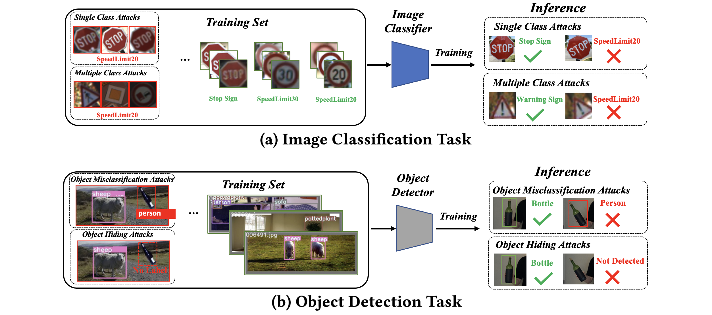

# Just Rotate it: Deploying Backdoor Attacks via Rotation Transformation


By [Tong Wu](https://tongwu2020.github.io/tongwu/), [Tianhao Wang](https://tianhaowang.netlify.app/), [Vikash Sehwag](https://vsehwag.github.io/), [Saeed Mahloujifar](https://smahloujifar.github.io/), [Prateek Mittal](https://www.princeton.edu/~pmittal/), from Princeton University 

[[Paper]](https://dl.acm.org/doi/abs/10.1145/3560830.3563730), [[Demo]](https://youtu.be/6JIF8wnX34M)

AISec'22: Proceedings of the 15th ACM Workshop on Artificial Intelligence and Security




## Requirements
The code is tested with Python 3.8 and PyTorch 1.7.0. The code should be compatible with other versions of packages.

## Datasets

- [GTSRB](https://benchmark.ini.rub.de/)
- [YouTube Faces](https://www.cs.tau.ac.il/~wolf/ytfaces/)
- [PASCAL](http://host.robots.ox.ac.uk/pascal/VOC/)

## Usage
- See  [bd_traffic/](bd_traffic/) to run experiments on traffic sign dataset (GTSRB). 
- See  [bd_face/](bd_face/) run experiments on face recognition dataset (YouTube Faces). 
- See  [bd_yolo/](bd_yolo/) run experiments on object detection dataset (PASCAL). 
- Since the main algorithm is easy to adapt to other dataset, we recommend writing the code within your own repo. 
- We also write the code `./other/rotate.py` that is compatible with [backdoor-toolbox](https://github.com/vtu81/backdoor-toolbox) to conduct more experiments. 


If anything is unclear, please open an issue or contact Tong Wu (tongwu@princeton.edu).

## Related and Referenced Repositories

- [backdoor-toolbox](https://github.com/vtu81/backdoor-toolbox)
- [yolor](https://github.com/WongKinYiu/yolor) 


## Reference

If you find this work helpful, consider citing it. 

```
@inproceedings{10.1145/3560830.3563730,
author = {Wu, Tong and Wang, Tianhao and Sehwag, Vikash and Mahloujifar, Saeed and Mittal, Prateek},
title = {Just Rotate It: Deploying Backdoor Attacks via Rotation Transformation},
year = {2022},
isbn = {9781450398800},
publisher = {Association for Computing Machinery},
address = {New York, NY, USA},
url = {https://doi.org/10.1145/3560830.3563730},
doi = {10.1145/3560830.3563730},
booktitle = {Proceedings of the 15th ACM Workshop on Artificial Intelligence and Security},
pages = {91–102},
numpages = {12},
keywords = {physically realizable attacks, spatial robustness, rotation backdoor attacks},
location = {Los Angeles, CA, USA},
series = {AISec'22}
}